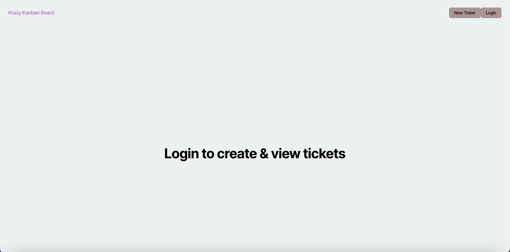
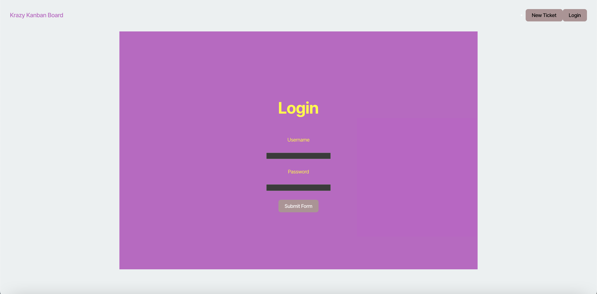
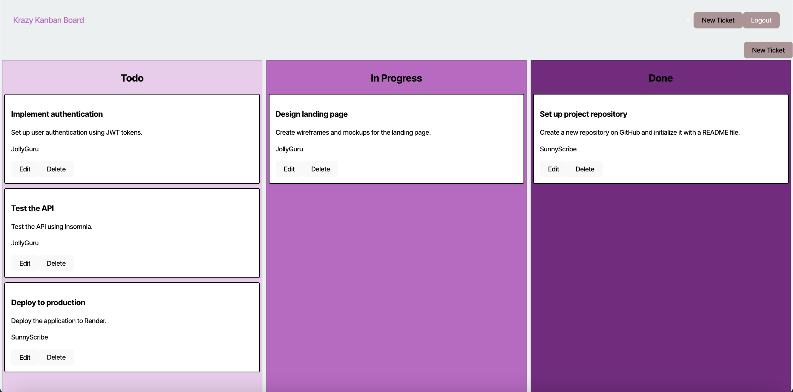

# Full-Stack-React-Kanban-Board


## Table of Contents

- [Technologies Used](#technologies-used)
- [Description](#description)
- [Features](#features)
- [Installation](#installation)
- [Usage](#usage)
- [License](#license)
- [Questions](#questions)

## Technologies Used

- React
- TypeScript
- Node.js
- Express
- PostgreSQL with Sequelize ORM
- JSON Web Token (JWT)

## Description

The Kanban Board Application is a web-based project management tool designed to help teams manage their workflow and tasks efficiently. The application supports adding, updating, and deleting tasks, moving tasks between different columns, and securing routes with JWT-based authentication. Users can login securely, and have personalized boards to organize their tasks.

## Features

- User Authentication
- Create, edit, and delete tasks
- Responsive design
- Secure JWT storage and automatic session expiration handling.

## Installation

1. Clone the Repository:
    ```
    git clone https://github.com/your-username/Challenge-14-Full-Stack-React-Kanban-Board.git
    cd Challenge-14-Full-Stack-React-Kanban-Board
    ```

2. Install Dependencies:
    ```
    npm install
    ```

3. Run the build command:
    ```
    npm run build
    ```

4. Run seeds:
    ```
    npm run seed
    ```

5. Run the Application:
    ```
    npm run start:dev
    ```

The Application should now be running locally at http://localhost:3000.

## Usage

1. Login to your account.
2. View the list of tasks in TODO, In Progress, and Done columns.
3. Create new task by clicking on "New Ticket" button.
4. Edit or delete tasks.
5. Logout of your account.

The following images show the web application's appearance and functionality:







Link to the deployed site:

https://full-stack-react-kanban-board.onrender.com

## License

MIT License

Copyright (c) 2024 ASgithub11

Permission is hereby granted, free of charge, to any person obtaining a copy
of this software and associated documentation files (the "Software"), to deal
in the Software without restriction, including without limitation the rights
to use, copy, modify, merge, publish, distribute, sublicense, and/or sell
copies of the Software, and to permit persons to whom the Software is
furnished to do so, subject to the following conditions:

The above copyright notice and this permission notice shall be included in all
copies or substantial portions of the Software.

THE SOFTWARE IS PROVIDED "AS IS", WITHOUT WARRANTY OF ANY KIND, EXPRESS OR
IMPLIED, INCLUDING BUT NOT LIMITED TO THE WARRANTIES OF MERCHANTABILITY,
FITNESS FOR A PARTICULAR PURPOSE AND NONINFRINGEMENT. IN NO EVENT SHALL THE
AUTHORS OR COPYRIGHT HOLDERS BE LIABLE FOR ANY CLAIM, DAMAGES OR OTHER
LIABILITY, WHETHER IN AN ACTION OF CONTRACT, TORT OR OTHERWISE, ARISING FROM,
OUT OF OR IN CONNECTION WITH THE SOFTWARE OR THE USE OR OTHER DEALINGS IN THE
SOFTWARE.

## Questions

If you have any questions, reach me on Github: https://github.com/ASgithub11

or email me here at aishasiddiqa151@gmail.com
